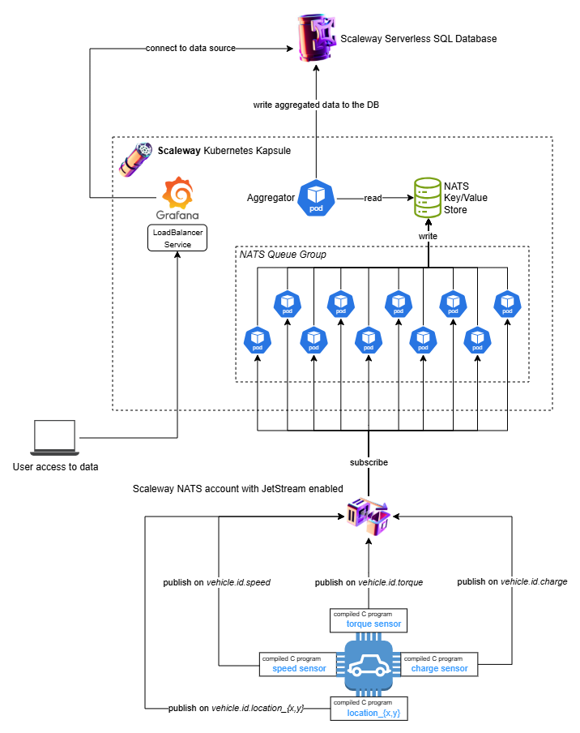

# Motivation
The goal of this project is to create a software that solves a simplified but reasonable real-world business scenario using Scaleway cloud services, with particular focus on its NATS and Kubernetes offerings. 

Scaleway is a French cloud provider that is often cited as [one of the major players in Europe's Sovereign Cloud market](https://gartsolutions.com/digital-sovereignty-of-europe-choosing-the-eu-cloud-provider/#Top_European_Cloud_Providers_Supporting_Digital_Sovereignty). Its relevance and market share will most likely grow in the future, as the demand for digital sovereignty in Europe continues to rise.

# Scenario
A car manufacturer wants to equip its new vehicle fleet with IoT sensors that calculate the position (GPS), speed, state of charge, and torque of vehicles in real-time. The sensors turn on as soon as the vehicle engine starts up, and they turn off when the vehicle gets shut down. Each sensor works independently from the others, which also means that the *sampling rate* (i.e., the number of times a signal is produced per second) can vary significantly. For example, a sensor might send 30 messages per second, while another sends only 5 messages per second.

The telemetry information detected by the sensors must be gathered into a centralized data storage solution, to allow for real-time analysis and visualization of vehicle status. In particular, the software must allow time-series analysis on specific vehicles, as well as aggregation of data coming from different vehicles.

There are some constraints:

- sensors have small amounts of CPU and memory, so the software must use resources efficiently;
- vehicle-to-cloud communication must be secure and resilient;
- data manipulation, storage and visualization must happen in the cloud, all in one single European sovereign cloud provider;
- the messaging protocol used to receive data from the sensors must be lightweight, reliable, and fast;
- the solution must be scalable, having to potentially collect data from thousands of vehicles at the same time;
- the solution must use as few cloud resources as possible, in order to minimize cloud footprint and costs.

# Solution

## Minimum infrastructure resources

### Client-side
- NATS client

### Server-side
- NATS server
- Kubernetes cluster

### Data visualization
- PostgreSQL managed instance
- Grafana instance

## Architecture diagram

## Explanation
The minimum resources presented above are all offered by Scaleway as PaaS (managed) services. The additional resources needed (e.g. Secret Manager) are also provided by Scaleway, which means that the constraint on the cloud provider can be respected.

Scaleway provides NATS accounts (aka servers). [NATS](https://github.com/nats-io) (Neural Autonomic Transport System) is a cloud-native, open-source messaging system designed around performance, security and ease of use. It has been part of the [CNCF landscape](https://landscape.cncf.io/) as an incubating project since 2018.

NATS implements the *publish-subscribe* pattern, in which the **publisher** sends a message on a communication channel (in NATS it is called **Subject**) the **subscriber** can listen (or subscribe) to.

For the use case at hand, we can assume that when a vehicle starts up, the ECU executes several NATS clients, one for each physical sensor. These clients publish messages to the NATS server, each on a separate hierarchical subject (e.g. vehicle.145.speed, where 145 is the id of the vehicle).

The NATS server is "observed" by a group of subscribers, all carrying out the same task: they read one incoming message at a time, and they write its payload to a dedicated store inside the NATS server. 

There is no subdivision of the subscribers into separate specialied groups. Instead, every subscriber can read every message, regardless of the topic the message belongs to. This architectural decision automatically ensures a fair and efficient use of the available compute resources, even in case of wildly different sensor sampling rates.

Of course, saving data to the NATS internal storage is not enough to achieve our end goals. There needs to be another service that aggregates data across the sensors at a common point in time, and writes a consistent, time-stamped record to a database. This is exactly what the aggregator does.

Once a record is written to the PostgreSQL database, the user can visualize it in the Grafana instance, which is configured with the database as a data source.

### Technical details

#### NATS and Queue Groups
NATS provides several interesting features. Some of them have been used here to achieve the target scenario. In this section I will explain the solution from a technical point of view, with a particular focus on these NATS concepts. 

A very important out-of-the-box feature of NATS are the Queue Groups. If multiple subscribers are assigned to the same Queue Group for a subject, each time a message is published on that subject, only one randomly selected subscriber receives it.

This makes it possible to have multiple subscribers listening in parallel to the same subject, each consuming a message that no other subscriber will ever read. This is crucial for the solution to this scenario, because it means that the number of subscribers can simply scale in or out according to the number of active vehicles.

However, Queue Groups alone don't prevent the risk of losing messages when the cluster where the subscribers run is down. The publish-subscribe pattern doesn't contemplate storing the messages, so when a message is sent, there needs to be at least one subscriber active on that subject, otherwise the message will be lost.

#### Subscribers implementation with JetStream and Key/Value Store
Luckily, NATS can be "enhanced" by using [JetStream](https://docs.nats.io/nats-concepts/jetstream), a persistence engine that enables messages to be stored and replayed at a later time. This crucially means that even in case there is no active subscriber when a message is fired, the message will not be lost.

JetStream also offers an *exactly once* quality of service. In other words, JetStream ensures that subscribers receive *all* the messages produced by the publishers without duplicates. All in all, these JetStream features make the system extremely resilient, stable, and scalable.

However, what really makes JetStream a must for this solution is the Key/Value Store, a feature that allows JetStream clients to create *buckets* (i.e. associative arrays, aka dictionaries), where they can store data in the form of key-value entries, thus replicating a functionality commonly found in proper key-value databases such as Redis.

I implemented the persistence of sensor messages using only one bucket, so that the aggregator workload can read data produced by every sensor and vehicle from a single data source (i.e., the bucket itself).

Thanks to a nice feature of the Python NATS library, the bucket is automatically created when the "first" subscriber requests a *pointer* to the bucket. When the other subscribers call the same method later on, JetStream recognizes that a bucket with that name already exists, so it doesn't create a new one and only returns a pointer to the existing one.

This comes very handy, because it implies that the subscribers can all run the same Python coroutine, so there is no need to implement a unique subscriber (or another workload) with the specific purpose of creating the bucket.

Operatively speaking, a subscriber is a member of the queue group, and as such it continuously waits for a message to come. As soon as it receives a message, the subscriber writes that piece of telemetry data to the bucket, mapping the value to a string key that contains information about the sensor and the vehicle the message was produced by. That is basically all that subscribers do, nothing more than that.

#### Aggregator implementation

The aggregator workload reads data from the bucket every *x* seconds, and for each vehicle it creates a record that contains one value for each sensor, then it persists it to the PostgreSQL database. If a sensor doesn't send data, then the aggregator simply puts NULL in place of the value.

Now it is interesting to think about how the Key/Value Store saves data. Let's consider this scenario: one of the vehicle's sensors produces messages every 2 seconds, while the aggregator is configured to read from the bucket once every minute. What could happen is that the aggregator finds `60/2 = 30` messages for that sensor, in case the entries get deleted from the bucket as soon as they are read, or maybe it finds all the entries ever stored.

In reality, Key/Value Store operates differently. When a new key-value entry is written to the bucket, what happens is that the previous value associated to that key, if already present, gets overwritten. This might be an undesirable effect for scenarios where you want to keep track of the bucket's history, but it is perfect in this case.

As a matter of fact, the aggregator doesn't really need to know all the values the publishers sent over time, rather just the last one they sent before the process of reading data from the bucket begins. Of course, in a real-world scenario this is true only for small intervals between two reads (at most 2-3 seconds), because a vehicle can change its state really quickly, for example when accelerating. Interpolation can also be used if the end goal is to derive continuous functions from discrete, timestamped measurements.

In this POC, the aggregator is configured to read at the turn of every new minute, which is probably not acceptable in reality, based on the explanation above. This parameter can also be changed to a lower value, but under a certain threshold the program *as-is* would not work anymore, because the process of reading from the bucket and writing to the database would not be finished in time to start a new step of this loop.

A workaround is to use multithreading in the aggregator core function, so that each thread can autonomously and concurrently take charge of a step.